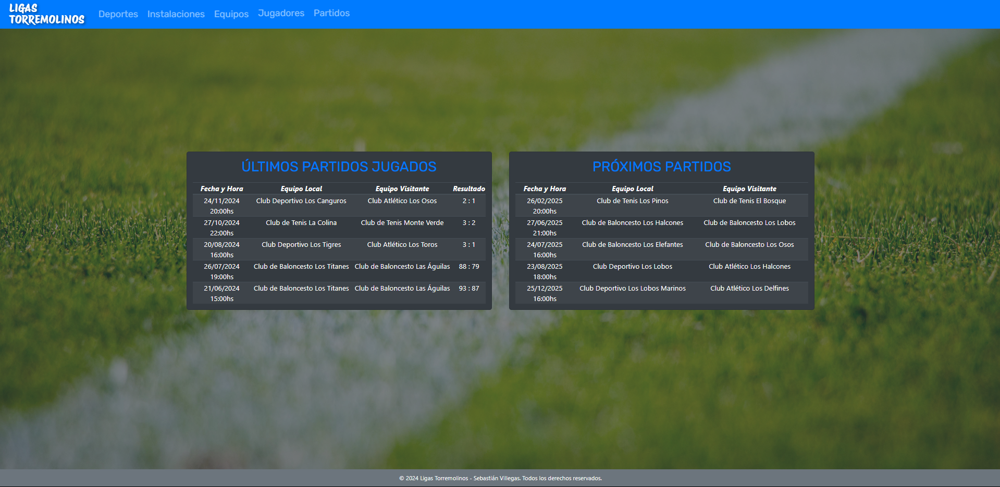
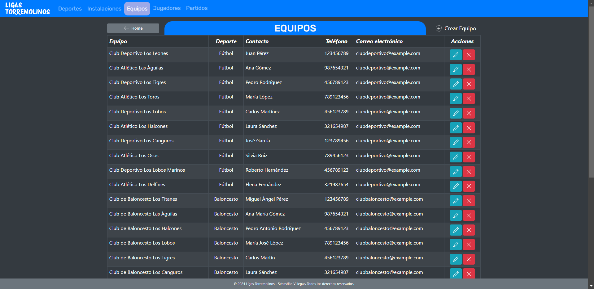
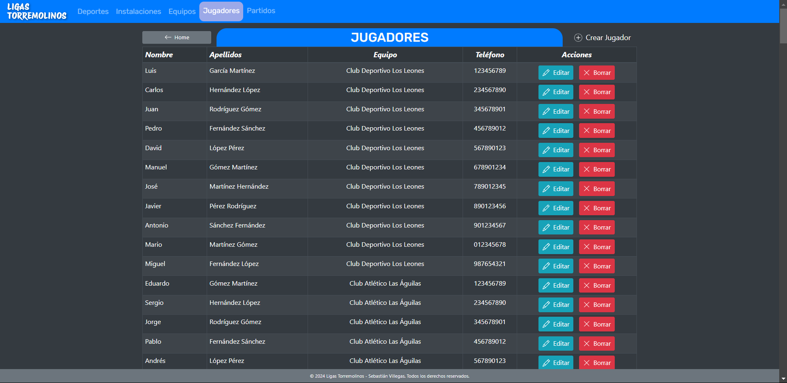
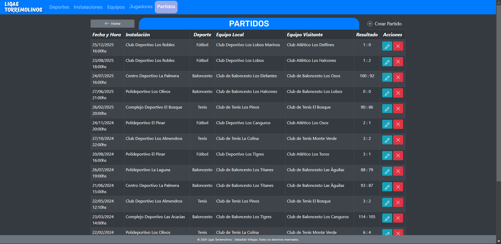
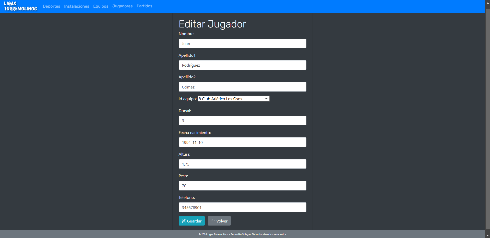
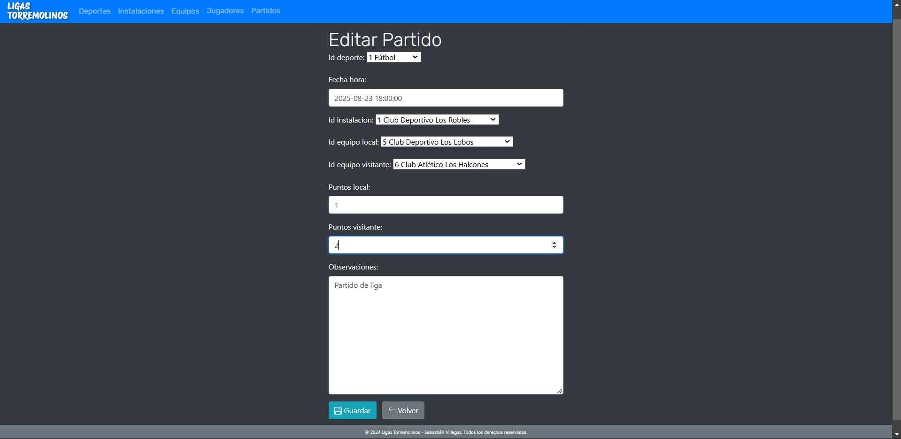

# 🏆 Ligas Torremolinos

> [!NOTE]
> Este proyecto fue generado con [Python 3.12.5](https://www.python.org/) y [Django](https://www.djangoproject.com/).

Ligas Torremolinos es un proyecto desarrollado para el **Ayuntamiento de Torremolinos** con el propósito de gestionar información relacionada con sus ligas deportivas.  

Incluye funcionalidades como:
- Gestión de datos de **ligas, equipos, jugadores y calendario de partidos**.
- Base de datos relacional para almacenamiento eficiente.
- **Servicio API** para la conexión con el backend.

---

## 🚀 Tecnologías Utilizadas

`**Python**`: Lenguaje principal utilizado para el desarrollo.

`**Django**`: Framework para el backend y la gestión de la lógica del servidor.

`**MySQL**`: Base de datos relacional utilizada para almacenar la información.

`**Bootstrap**`: Framework CSS para diseño responsivo.

---

## 📸 Capturas de Pantalla

> [!TIP]
> Algunas capturas del sistema en acción:

### Inicio


### Equipos


### Jugadores


### Partidos


### Editar Jugador


### Editar Partido


---

## 🛠️ Instalación, Configuración y Ejecución

> [!IMPORTANT]
> Asegúrate de tener instalados los siguientes programas en tu sistema:

- **Python 3.12+**
- **Pip** (gestor de paquetes de Python)
- **MySQL** (opcional, si se configura en `settings.py`)
- **Entorno virtual configurado** (recomendado)

--

### 1. Clonar el repositorio

> [!TIP]
> Clona este proyecto en tu máquina local utilizando Git:

```
git clone https://github.com/sebastianvillegas7/LigasTorremolinos.git
```


### 2. Crear un entorno virtual
> Ejecuta los siguientes comandos:

```
python -m venv venv

venv\Scripts\activate

pip install django mysqlclient
```


### 3. Configurar la base de datos
>[!IMPORTANT]
> El proyecto utiliza MySQL, configurado en `settings.py` con credenciales por defecto. Modificar en caso de ser necesario.


### 4. Migrar la base de datos
> Ejecuta los siguientes comandos:

```
python manage.py makemigrations

python manage.py migrate
```


### 5. Ejecutar el servidor de desarrollo
> Ejecuta el siguiente comando:

```
python manage.py runserver
```


> [!IMPORTANT]
> Luego, abre tu navegador y ve a:

**http://127.0.0.1:8000**
